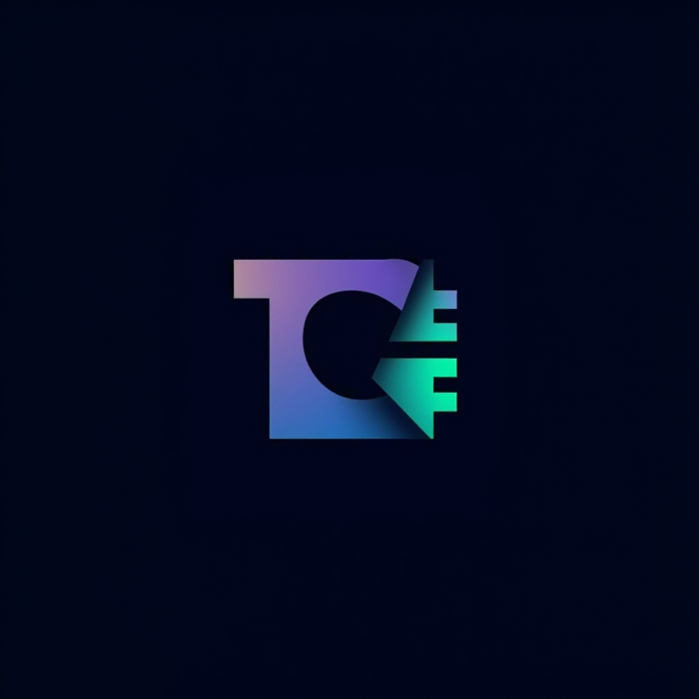

<div align="center">



# ThemeCraft 🎨

**Professional Code Editor Theme Designer & Visual Editor**

Create stunning themes for VSCode, Cursor, Zed, Neovim, and Helix with our intuitive visual editor and live preview system.

[](https://vercel.com/new/clone?repository-url=https://github.com/SymphonyIceAttack/themecraft?tab=readme-ov-file)
[](https://nextjs.org/)
[](https://www.typescriptlang.org/)
[](https://tailwindcss.com/)
[](LICENSE)
[](https://github.com/SymphonyIceAttack/themecraft)
[](https://github.com/SymphonyIceAttack/themecraft)

**Live Demo** • **[Theme Editor](https://themecraft.top/editor)** • **[Documentation](https://themecraft.top/docs)** • **[Blog](https://themecraft.top/posts)** • **[FAQ](https://themecraft.top/faq)**

</div>

## ✨ Key Features

### 🎨 Visual Theme Editor
- **Intuitive Color Controls**: Advanced color picker with RGB, HSL, and OKLCH support
- **Real-time Preview**: See your theme applied to actual code samples instantly
- **Professional Tools**: Industry-standard color management and fine-tuning options

### 🔧 Multi-Editor Support
- **VSCode Themes**: Generate complete `.json` theme files
- **Cursor Themes**: Export for Cursor IDE compatibility
- **Zed Themes**: Support for Zed editor color schemes
- **Neovim Colorscheme**: Lua-based colorscheme generation
- **Helix Themes**: TOML configuration support

### 📱 Modern Interface
- **Responsive Design**: Works perfectly on desktop and mobile
- **Dark/Light Mode**: Seamless theme switching
- **Glass Morphism UI**: Beautiful, modern interface design
- **Real-time Collaboration**: Share and collaborate on themes

## 🚀 Quick Start

### Prerequisites
- Node.js 18+
- pnpm (recommended package manager)

### Installation

1. **Clone the repository**
   ```bash
   git clone https://github.com/SymphonyIceAttack/themecraft.git
   cd themecraft
   ```

2. **Install pnpm** (if you don't have it)
   ```bash
   npm install -g pnpm
   ```

3. **Install dependencies**
   ```bash
   pnpm install
   ```

4. **Start development server**
   ```bash
   pnpm dev
   ```

5. **Open your browser**
   Navigate to [https://themecraft.top](https://themecraft.top)

## 📖 Usage Guide

### Creating Your First Theme

1. **Start Designing**
   - Visit the [Theme Editor](https://themecraft.top/editor)
   - Choose a base theme or start from scratch

2. **Customize Colors**
   - Use the visual color picker
   - Adjust syntax highlighting colors
   - Modify UI elements

3. **Preview Your Theme**
   - View real-time code preview
   - Test with different programming languages
   - Check accessibility compliance

4. **Export & Install**
   - Select your target editor
   - Download the theme file
   - Install directly in your code editor

### Supported Editors

| Editor | Format | Installation |
|--------|--------|-------------|
| **VSCode** | `.json` | Extensions folder |
| **Cursor** | `.json` | User settings |
| **Zed** | `.toml` | Settings |
| **Neovim** | `.lua` | Colors folder |
| **Helix** | `.toml` | Config folder |

## 🛠️ Technology Stack

### Core Technologies
- **[Next.js 16](https://nextjs.org/)** - React framework with App Router
- **[React 19](https://react.dev/)** - UI library with latest features
- **[TypeScript](https://www.typescriptlang.org/)** - Type-safe JavaScript
- **[Tailwind CSS 4](https://tailwindcss.com/)** - Utility-first CSS framework

### UI & Components
- **[Radix UI](https://www.radix-ui.com/)** - Accessible UI primitives
- **[shadcn/ui](https://ui.shadcn.com/)** - Beautiful component library
- **[Lucide React](https://lucide.dev/)** - Icon library
- **[Class Variance Authority](https://cva.style/)** - Type-safe component variants

### Development Tools
- **[Biome](https://biomejs.dev/)** - Linting and formatting
- **[Vercel Analytics](https://vercel.com/analytics)** - Performance monitoring
- **[Directus](https://directus.io/)** - CMS for blog content
- **[Shiki](https://shiki.matsu.io/)** - Syntax highlighting

## 📁 Project Structure

```
themecraft/
├── app/                    # Next.js App Router
│   ├── layout.tsx         # Root layout with providers
│   ├── page.tsx           # Homepage
│   ├── editor/            # Theme editor
│   ├── posts/             # Blog posts
│   ├── api/               # API routes
│   └── globals.css        # Global styles
├── components/            # React components
│   ├── ui/               # shadcn/ui base components
│   ├── theme-editor.tsx  # Main editor
│   ├── code-preview.tsx  # Live preview
│   └── export-dialog.tsx # Export functionality
├── lib/                   # Utility functions
│   ├── utils.ts          # Common utilities
│   ├── color-utils.ts    # Color manipulation
│   └── theme-converters.ts # Format converters
├── types/                 # TypeScript definitions
└── public/               # Static assets
```

## 🤝 Contributing

We welcome contributions! Please read our [Contributing Guide](CONTRIBUTING.md) for details on our code of conduct and the process for submitting pull requests.

### Development Setup

1. Fork the repository
2. Create a feature branch: `git checkout -b feature/amazing-feature`
3. Make your changes
4. Run tests and linting: `npm run lint`
5. Commit your changes: `git commit -m 'Add amazing feature'`
6. Push to the branch: `git push origin feature/amazing-feature`
7. Open a Pull Request

### Contribution Guidelines

- Follow our code style guidelines
- Add tests for new features
- Update documentation as needed
- Ensure all tests pass
- Write descriptive commit messages

## 📝 License

This project is licensed under the MIT License - see the [LICENSE](LICENSE) file for details.

## 🌟 Show Your Support

If you find ThemeCraft helpful, please consider:

- ⭐ **Starring** this repository
- 🔗 **Sharing** with other developers
- 🐛 **Reporting** bugs and issues
- 💡 **Suggesting** new features
- 🤝 **Contributing** to the project

## 📧 Contact & Support

- **Website**: [https://themecraft.top](https://themecraft.top)
- **GitHub Repository**: [https://github.com/SymphonyIceAttack/themecraft](https://github.com/SymphonyIceAttack/themecraft)
- **Developer**: [@SymphonyIceAttack](https://github.com/SymphonyIceAttack)
- **Blog**: [ThemeCraft Blog](https://themecraft.top/posts)

## 🙏 Acknowledgments

- **Vercel** - For amazing hosting and deployment
- **Next.js Team** - For the incredible framework
- **React Team** - For the amazing UI library
- **Tailwind CSS** - For the utility-first CSS framework
- **Community** - For feedback and contributions

## 📊 SEO Keywords

*code editor theme*, *vscode theme*, *cursor theme*, *zed theme*, *neovim colorscheme*, *helix theme*, *theme editor*, *color scheme generator*, *syntax highlighting themes*, *theme creator*, *code editor customization*, *visual theme designer*, *code syntax colors*, *developer tools*, *productivity tools*, *code styling*, *theme library*, *color palette generator*, *syntax highlighting editor*, *code color schemes*

---

<div align="center">

**Made with ❤️ by [SymphonyIceAttack](https://github.com/SymphonyIceAttack)**

[](https://github.com/SymphonyIceAttack/themecraft)
[](https://github.com/SymphonyIceAttack/themecraft)

[⬆️ Back to Top](#themecraft-)

</div>